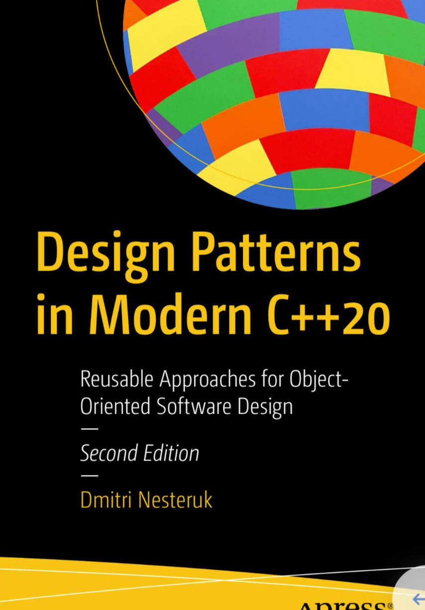

<!--
 * @Date: 2023-07-01 23:25:59
 * @Author: mental1104 mental1104@gmail.com
 * @LastEditors: mental1104 mental1104@gmail.com
 * @LastEditTime: 2023-07-03 23:30:12
-->
# design-patterns-cpp20
## C++ 20 design-paterns



Usage: 

```
mkdir build
cd build
cmake ..
make -j8
```


## Boost Dependency
Download Boost:

`sudo apt-get install libboost-all-dev`  

use boost::ext::di:  
`cd /usr/include/boost`    
`wget https://raw.githubusercontent.com/boost-ext/di/cpp14/include/boost/di.hpp`   
 
Document:    
`https://boost-ext.github.io/di/user_guide.html`    
